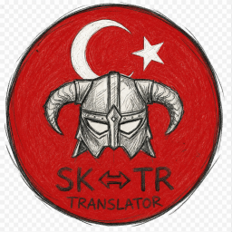

<p align="center">
  
</p>

# NexusMods Translation Download Wizard

Skyrim mod listeleri için hazırlanmış Türkçe çeviri kurulum aracıdır. Hazır
çeviri listesine göre gerekli NexusMods dosyalarını indirir ve sonucu seçilen
MO2 mod listesinin `mods` klasörüne hazırlar.

Author: [c0kadam](https://github.com/c0kadam)

License: BSD 3-Clause. See [LICENSE](LICENSE).

## Kullanım

1. Zip dosyasını çıkarın.
2. `CeviriAraci.exe` dosyasını çalıştırın.
3. Modlist klasörünü ve MO2 profilini seçin.
4. Premium API veya ücretsiz/tarayıcı indirme yöntemini seçin.
5. `Çevirileri indir` düğmesine basın.
6. İndirme tamamlanınca `Çeviriyi hazırla` düğmesine basın.
7. MO2 içinde oluşturulan çeviri modunu aktif edin.

## Kaynaktan Çalıştırma

Gereksinimler:

- Windows
- Python 3.11
- Bu repo ile `Modlist Translate Tool` klasörünün aynı üst klasörde bulunması

PowerShell:

```powershell
cd "<MTW repo klasörü>"
python -m venv .venv
.\.venv\Scripts\Activate.ps1
python -m pip install -U pip
python -m pip install -e "<Modlist Translate Tool repo klasörü>"
python -m pip install -r requirements.txt
python -B -m modlist_translation_wizard
```

## Exe Oluşturma

Standalone klasör ve zip üretmek için:

```powershell
cd "<MTW repo klasörü>"
.\.venv\Scripts\Activate.ps1
powershell -ExecutionPolicy Bypass -File scripts\build_standalone.ps1 -WindowsResources -AssumeYesForDownloads
```

Çıktılar:

```text
dist\standalone\CeviriAraci.exe
dist\standalone.zip
```

Farklı bir release manifest/branding klasörü kullanmak için:

```powershell
powershell -ExecutionPolicy Bypass -File scripts\build_standalone.ps1 `
  -ReleaseSource "src\modlist_translation_wizard\resources\releases\<release-id>" `
  -WindowsResources `
  -AssumeYesForDownloads
```

## Çıktı

```text
<Modlist klasörü>\mods\<Modlist adı> - Turkce Ceviri
```

## Mod Listesi Çeviri Paketi Hazırlama

Bu aracı kendi mod listeniz için paketlemek istiyorsanız kısa başlangıç rehberi:
[docs/creating-a-release.md](docs/creating-a-release.md)

Release paketleri istenirse remote manifest kanalıyla da dağıtılabilir. Bu modelde
GUI'deki `OTA (Güncel)` seçeneği `NTDW-TranslationMAPS` gibi bir manifest deposundan
doğrulanmış güncel listeyi alır. `Yerel` seçeneği ağ isteği yapmadan release içindeki
manifesti kullanır. OTA seçiliyken liste her uygulama açılışında yeniden indirilir;
önbelleğe veya yerel manifeste sessiz geçiş yapılmaz. Oturumluk OTA önbelleği uygulama
kapanınca silinir. Ayrıntılar aynı rehberdeki `Uzaktan Manifest Kanalı` bölümündedir.

Standalone pakette kullanıcıya açık release verileri yalnızca `release/` klasöründedir.
Yanındaki `modlist_translation_wizard/` klasörü derlenmiş uygulamanın çalışma zamanı
dosyalarını içerir ve düzenlenmemelidir. Yerel manifest ile OTA birlikte kullanılamazsa
uygulama kapanmak yerine kaynak kurtarma ekranını açar ve kaynak seçimini kullanıcıya
bırakır.

## Notlar

- MO2 profiliniz ve `modlist.txt` otomatik değiştirilmez.
- API anahtarı ve geçici indirme bilgileri loglara yazılmaz.
- Ücretsiz modda NexusMods sayfası tarayıcıda açılır; Slow Download düğmesine
  kullanıcı tıklar.
- Repo içindeki LoreRim dosyaları örnek release yapısıdır; araç farklı manifest
  ve branding dosyalarıyla başka mod listeleri için de paketlenebilir.

## Lisans

Bu proje BSD 3-Clause lisansı ile yayımlanır.
